# Nexus — AI-First Quantitative Trading Platform

> An event-driven, modular, AI-first quantitative trading platform built on IBKR data feeds,
> with full backtesting, paper/live trading, real-time observability, and a PostgreSQL persistence layer
> managed by Liquibase.
>
> **Status: Phases 1–4 complete.** Foundation → Strategy Core → Backtesting Engine → AI/ML Pipeline.
> Phase 5 (Production / Live Trading) is next.

---

## Table of Contents

1. [Design Principles](#design-principles)
2. [System Context](#1-system-context-c4-level-1)
3. [Container Architecture](#2-container-architecture-c4-level-2)
4. [Data Flow](#3-data-flow)
5. [Event Bus & Component Telemetry](#4-event-bus--component-telemetry)
6. [Data Ingestion Layer](#5-data-ingestion-layer)
7. [Strategy & AI Engine](#6-strategy--ai-engine)
8. [Order Management System](#7-order-management-system-oms)
9. [Backtesting Engine](#8-backtesting-engine)
10. [Database Schema Overview](#9-database-schema-overview)
11. [Security Model](#10-security-model)
12. [Technology Stack](#technology-stack)
13. [Known Constraints & Risks](#known-constraints--risks)
14. [Development Phases](#development-phases)

---

## Design Principles

| Principle | Description |
|-----------|-------------|
| **AI-First** | Every module exposes parameters consumable by AI agents; strategy logic is ML-replaceable |
| **Modular** | Each component is independently deployable and observable |
| **Data-Driven** | All component state/config is persisted and driven from data, never hardcoded |
| **Event-Driven** | Components communicate via an in-memory event bus; no direct coupling |
| **Observable** | Every component emits timestamped telemetry events; UI is a passive consumer |
| **Safe by Default** | Paper trading is the default; live trading requires explicit multi-step activation |
| **Schema-Managed** | All DB changes via Liquibase changesets, never manual |

---

## 1. System Context (C4 Level 1)

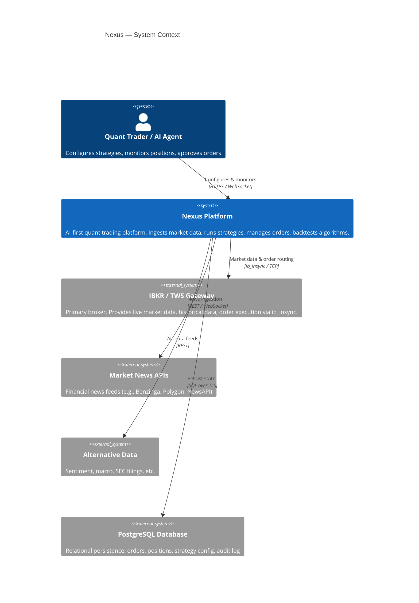
```mermaid
C4Context
    title Nexus — System Context

    Person(trader, "Quant Trader / AI Agent", "Configures strategies, monitors positions, approves orders")

    System(nexus, "Nexus Platform", "AI-first quant trading platform. Ingests market data, runs strategies, manages orders, backtests algorithms.")

    System_Ext(ibkr, "IBKR / TWS Gateway", "Primary broker. Provides live market data, historical data, order execution via ib_insync.")
    System_Ext(news, "Market News APIs", "Financial news feeds (e.g., Benzinga, Polygon, NewsAPI)")
    System_Ext(altdata, "Alternative Data", "Sentiment, macro, SEC filings, etc.")
    System_Ext(postgres, "PostgreSQL Database", "Relational persistence: orders, positions, strategy config, audit log")

    Rel(trader, nexus, "Configures & monitors", "HTTPS / WebSocket")
    Rel(nexus, ibkr, "Market data & order routing", "ib_insync / TCP")
    Rel(nexus, news, "News ingestion", "REST / WebSocket")
    Rel(nexus, altdata, "Alt data feeds", "REST")
    Rel(nexus, postgres, "Persist state", "SQL over TLS")
```

---

## 2. Container Architecture (C4 Level 2)


```mermaid
C4Container
    title Nexus — Container Architecture

    Person(user, "Trader / AI Agent")

    Container_Boundary(nexus, "Nexus Platform") {

        Container(gateway, "API Gateway", "FastAPI", "REST + WebSocket endpoints. Auth, rate limiting.")
        Container(ui, "Dashboard UI", "React / Streamlit", "Real-time parameter display, telemetry stream, order blotter")
        Container(bus, "Event Bus", "Redis Streams", "In-memory pub/sub backbone. All components publish timestamped events here.")
        Container(ingestion, "Data Ingestion Service", "Python / ib_insync", "Connects to IBKR TWS/Gateway. Streams ticks, bars, news.")
        Container(strategy, "Strategy Engine", "Python", "Hosts and executes trading strategies. Emits signals.")
        Container(ai, "AI / ML Engine", "Python / PyTorch / sklearn", "Model training, inference, feature engineering. Feeds signals to Strategy Engine.")
        Container(oms, "Order Management System", "Python", "Receives signals, applies risk checks, routes to broker or paper engine.")
        Container(paper, "Paper Trading Engine", "Python", "Simulates order fills using live market data. No real money.")
        Container(backtest, "Backtesting Engine", "Python / VectorBT / Zipline-reloaded", "Replays historical data through strategies. Generates performance reports.")
        Container(risk, "Risk Manager", "Python", "Position limits, drawdown guards, VaR, kill switch.")
        Container(telemetry, "Telemetry Aggregator", "Python", "Subscribes to all event bus channels. Aggregates, persists, exposes via WebSocket.")
        Container(scheduler, "Scheduler / Cron", "APScheduler", "Triggers data pulls, model retraining, report generation.")
        Container(dbmgr, "DB Migration Manager", "Liquibase", "Manages PostgreSQL schema via versioned changesets.")
    }

    System_Ext(ibkr, "IBKR TWS / Gateway")
    System_Ext(newsapi, "News APIs")
    System_Ext(postgres, "PostgreSQL DB")
    System_Ext(timeseries, "Time-Series Store (optional)", "TimescaleDB or InfluxDB for tick-level data")

    Rel(user, gateway, "REST / WS", "HTTPS")
    Rel(user, ui, "Browser / CLI", "HTTPS / WS")

    Rel(gateway, bus, "Publish commands")
    Rel(ui, telemetry, "Subscribe to telemetry", "WebSocket")

    Rel(ingestion, ibkr, "ib_insync", "TCP")
    Rel(ingestion, newsapi, "REST / WS")
    Rel(ingestion, bus, "Publish market data events")

    Rel(bus, strategy, "Market data events")
    Rel(strategy, ai, "Feature requests / inference")
    Rel(strategy, bus, "Publish signals")

    Rel(bus, oms, "Signal events")
    Rel(oms, risk, "Risk check")
    Rel(oms, paper, "Paper orders")
    Rel(oms, ibkr, "Live orders (guarded)")
    Rel(oms, bus, "Publish order events")

    Rel(bus, backtest, "Historical data events (replay mode)")
    Rel(backtest, bus, "Publish backtest results")

    Rel(telemetry, bus, "Subscribe all channels")
    Rel(telemetry, postgres, "Persist telemetry")
    Rel(telemetry, ui, "Push telemetry", "WebSocket")

    Rel(dbmgr, postgres, "Schema migrations")
    Rel(ingestion, timeseries, "Write ticks/bars")
    Rel(strategy, timeseries, "Read OHLCV / tick history")
    Rel(strategy, postgres, "Read/write strategy config")
    Rel(oms, postgres, "Persist orders, fills, positions")
    Rel(scheduler, bus, "Trigger events")
```

---

## 3. Data Flow

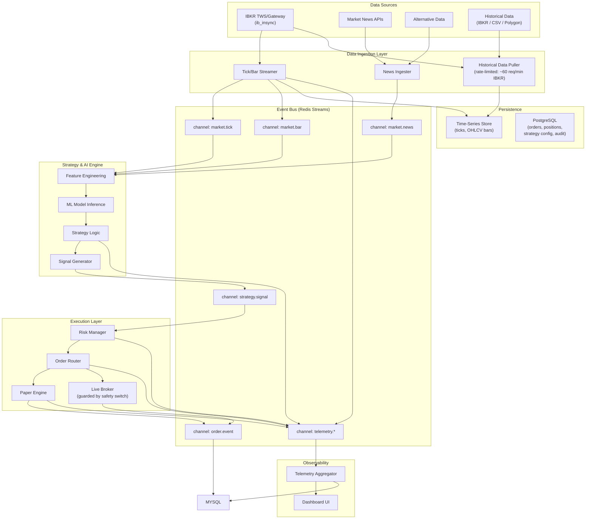
```mermaid
flowchart TD
    subgraph Sources["Data Sources"]
        IBKR["IBKR TWS/Gateway\n(ib_insync)"]
        NEWS["Market News APIs"]
        ALT["Alternative Data"]
        HIST["Historical Data\n(IBKR / CSV / Polygon)"]
    end

    subgraph Ingestion["Data Ingestion Layer"]
        TICK["Tick/Bar Streamer"]
        NEWSING["News Ingester"]
        HISTPULL["Historical Data Puller\n(rate-limited: ~60 req/min IBKR)"]
    end

    subgraph Bus["Event Bus (Redis Streams)"]
        CH_TICK["channel: market.tick"]
        CH_BAR["channel: market.bar"]
        CH_NEWS["channel: market.news"]
        CH_SIG["channel: strategy.signal"]
        CH_ORD["channel: order.event"]
        CH_TEL["channel: telemetry.*"]
    end

    subgraph Strategy["Strategy & AI Engine"]
        FE["Feature Engineering"]
        ML["ML Model Inference"]
        STRAT["Strategy Logic"]
        SIG["Signal Generator"]
    end

    subgraph Execution["Execution Layer"]
        RISK["Risk Manager"]
        OMS["Order Router"]
        PAPER["Paper Engine"]
        LIVE["Live Broker\n(guarded by safety switch)"]
    end

    subgraph Persistence["Persistence"]
        TS["Time-Series Store\n(ticks, OHLCV bars)"]
        POSTGRES["PostgreSQL\n(orders, positions,\nstrategy config, audit)"]
    end

    subgraph Observability["Observability"]
        TEL["Telemetry Aggregator"]
        UI["Dashboard UI"]
    end

    IBKR --> TICK
    IBKR --> HISTPULL
    NEWS --> NEWSING
    ALT --> NEWSING
    HIST --> HISTPULL

    TICK --> CH_TICK
    TICK --> CH_BAR
    TICK --> TS
    NEWSING --> CH_NEWS
    HISTPULL --> TS

    CH_TICK --> FE
    CH_BAR --> FE
    CH_NEWS --> FE
    FE --> ML
    ML --> STRAT
    STRAT --> SIG
    SIG --> CH_SIG

    CH_SIG --> RISK
    RISK --> OMS
    OMS --> PAPER
    OMS --> LIVE

    PAPER --> CH_ORD
    LIVE --> CH_ORD
    CH_ORD --> MYSQL

    CH_TEL --> TEL
    TEL --> UI
    TEL --> MYSQL

    STRAT --> CH_TEL
    OMS --> CH_TEL
    RISK --> CH_TEL
    PAPER --> CH_TEL
    TICK --> CH_TEL
```

---

## 4. Event Bus & Component Telemetry

Every component emits a standardized telemetry event. The UI consumes these passively.

### Telemetry Event Schema

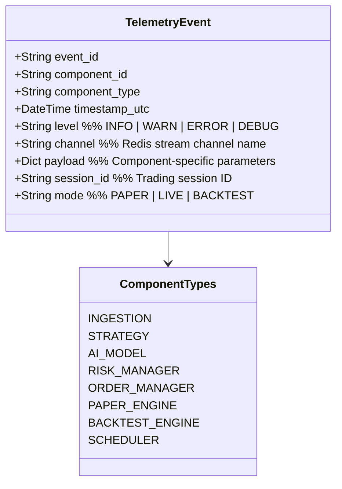
```mermaid
classDiagram
    class TelemetryEvent {
        +String event_id
        +String component_id
        +String component_type
        +DateTime timestamp_utc
        +String level        %%  INFO | WARN | ERROR | DEBUG
        +String channel      %%  Redis stream channel name
        +Dict  payload       %%  Component-specific parameters
        +String session_id   %%  Trading session ID
        +String mode         %%  PAPER | LIVE | BACKTEST
    }

    class ComponentTypes {
        INGESTION
        STRATEGY
        AI_MODEL
        RISK_MANAGER
        ORDER_MANAGER
        PAPER_ENGINE
        BACKTEST_ENGINE
        SCHEDULER
    }

    TelemetryEvent --> ComponentTypes
```

### Redis Streams Channel Map

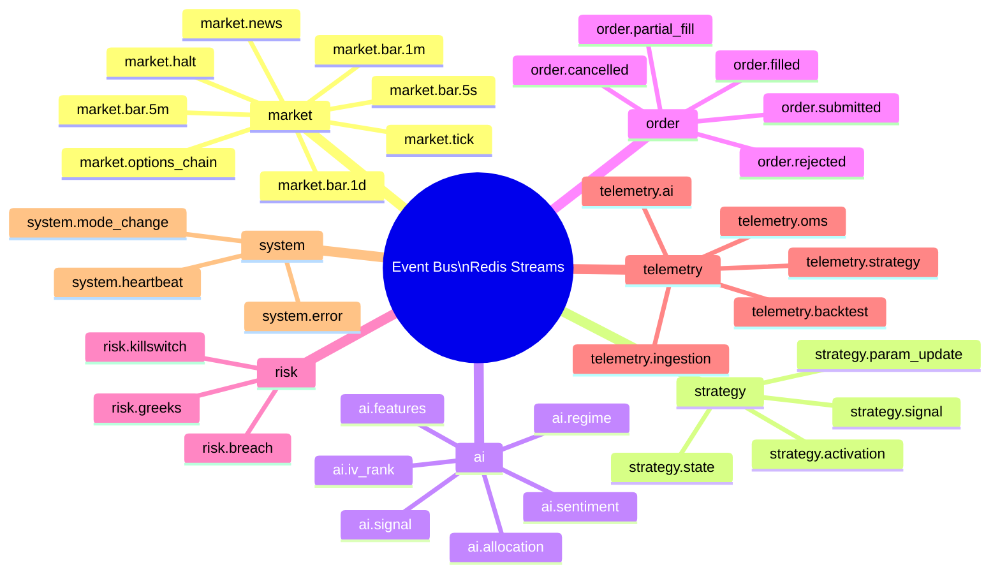
```mermaid
mindmap
  root((Event Bus\nRedis Streams))
    market
      market.tick
      market.bar.5s
      market.bar.1m
      market.bar.5m
      market.bar.1d
      market.options_chain
      market.news
      market.halt
    strategy
      strategy.signal
      strategy.activation
      strategy.param_update
      strategy.state
    ai
      ai.features
      ai.regime
      ai.iv_rank
      ai.sentiment
      ai.signal
      ai.allocation
    order
      order.submitted
      order.filled
      order.partial_fill
      order.cancelled
      order.rejected
    risk
      risk.breach
      risk.greeks
      risk.killswitch
    telemetry
      telemetry.ingestion
      telemetry.strategy
      telemetry.oms
      telemetry.ai
      telemetry.backtest
    system
      system.heartbeat
      system.error
      system.mode_change
```

---

## 5. Data Ingestion Layer

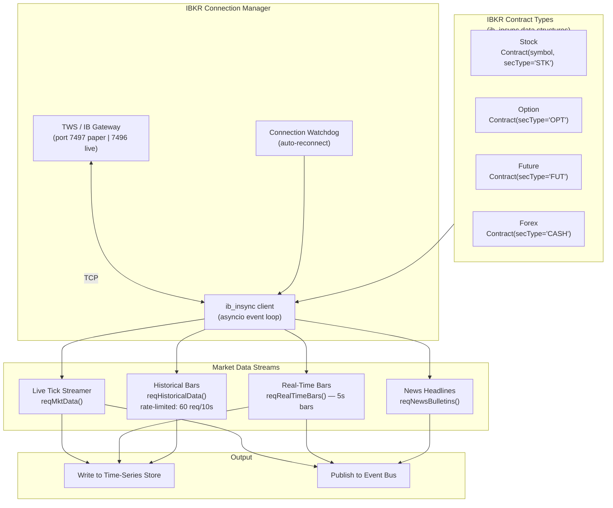
```mermaid
flowchart TD
    subgraph IBKR_Conn["IBKR Connection Manager"]
        TWS["TWS / IB Gateway\n(port 7497 paper | 7496 live)"]
        IB["ib_insync client\n(asyncio event loop)"]
        WATCHDOG["Connection Watchdog\n(auto-reconnect)"]
    end

    subgraph MarketData["Market Data Streams"]
        LIVE_TICK["Live Tick Streamer\nreqMktData()"]
        LIVE_BAR["Real-Time Bars\nreqRealTimeBars() — 5s bars"]
        HIST_BAR["Historical Bars\nreqHistoricalData()\nrate-limited: 60 req/10s"]
        NEWS_BUL["News Headlines\nreqNewsBulletins()"]
    end

    subgraph Contracts["IBKR Contract Types\n(ib_insync data structures)"]
        STK["Stock\nContract(symbol, secType='STK')"]
        OPT["Option\nContract(secType='OPT')"]
        FUT["Future\nContract(secType='FUT')"]
        FX["Forex\nContract(secType='CASH')"]
    end

    subgraph Output["Output"]
        TS_WRITE["Write to Time-Series Store"]
        BUS_PUB["Publish to Event Bus"]
    end

    TWS <-->|TCP| IB
    WATCHDOG --> IB
    IB --> LIVE_TICK
    IB --> LIVE_BAR
    IB --> HIST_BAR
    IB --> NEWS_BUL

    Contracts --> IB

    LIVE_TICK --> TS_WRITE
    LIVE_TICK --> BUS_PUB
    LIVE_BAR --> TS_WRITE
    LIVE_BAR --> BUS_PUB
    HIST_BAR --> TS_WRITE
    NEWS_BUL --> BUS_PUB
```

**IBKR Data Limits to design around:**
- Paper account: 100 simultaneous market data lines
- Historical data: ~60 requests / 10 minutes
- Real-time bars: 5-second granularity minimum via API

---

## 6. Strategy & AI Engine

### 6a. Strategy Engine

| File | Class | Responsibility |
|------|-------|----------------|
| `nexus/strategy/base.py` | `BaseStrategy` | ABC: `on_bar`, `on_tick`, `on_news`, `on_options_chain`, `emit_signal`, hot-reload params |
| `nexus/strategy/registry.py` | `StrategyRegistry` | Dynamic import, event routing, `strategy.activation` consumer, activate/deactivate guard |
| `nexus/strategy/strategies/ma_crossover.py` | `MovingAverageCrossover` | Golden/death cross; confidence-scored signals |
| `nexus/strategy/strategies/iron_condor.py` | `IronCondor` | IVR-gated 4-leg options strategy; profit target/stop management |

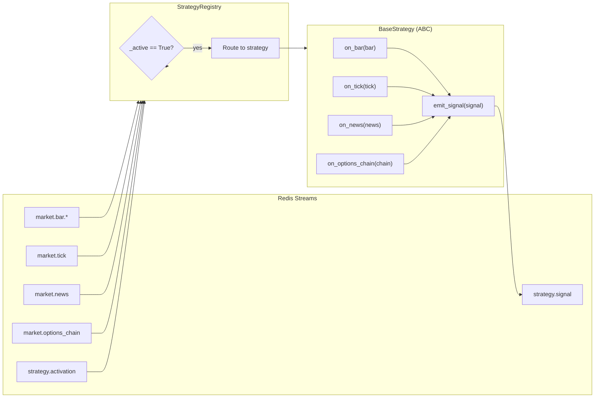
```mermaid
flowchart LR
    subgraph Bus["Redis Streams"]
        direction TB
        MKTBAR["market.bar.*"]
        MKTTICK["market.tick"]
        MKTNEWS["market.news"]
        MKTOPT["market.options_chain"]
        SIGOUT["strategy.signal"]
        ACTIV["strategy.activation"]
    end

    subgraph Registry["StrategyRegistry"]
        ACTIVE{"_active == True?"}
        ROUTE["Route to strategy"]
    end

    subgraph ABC["BaseStrategy (ABC)"]
        ON_BAR["on_bar(bar)"]
        ON_TICK["on_tick(tick)"]
        ON_NEWS["on_news(news)"]
        ON_OPT["on_options_chain(chain)"]
        EMIT["emit_signal(signal)"]
    end

    MKTBAR --> Registry
    MKTTICK --> Registry
    MKTNEWS --> Registry
    MKTOPT --> Registry
    ACTIV --> Registry

    Registry --> ACTIVE
    ACTIVE -->|yes| ROUTE
    ROUTE --> ABC

    ON_BAR --> EMIT
    ON_TICK --> EMIT
    ON_NEWS --> EMIT
    ON_OPT --> EMIT
    EMIT --> SIGOUT
```

### 6b. AI / ML Pipeline (Phase 4)

Seven components in `nexus/ai/`. All publish to `ai.*` channels on Redis Streams.

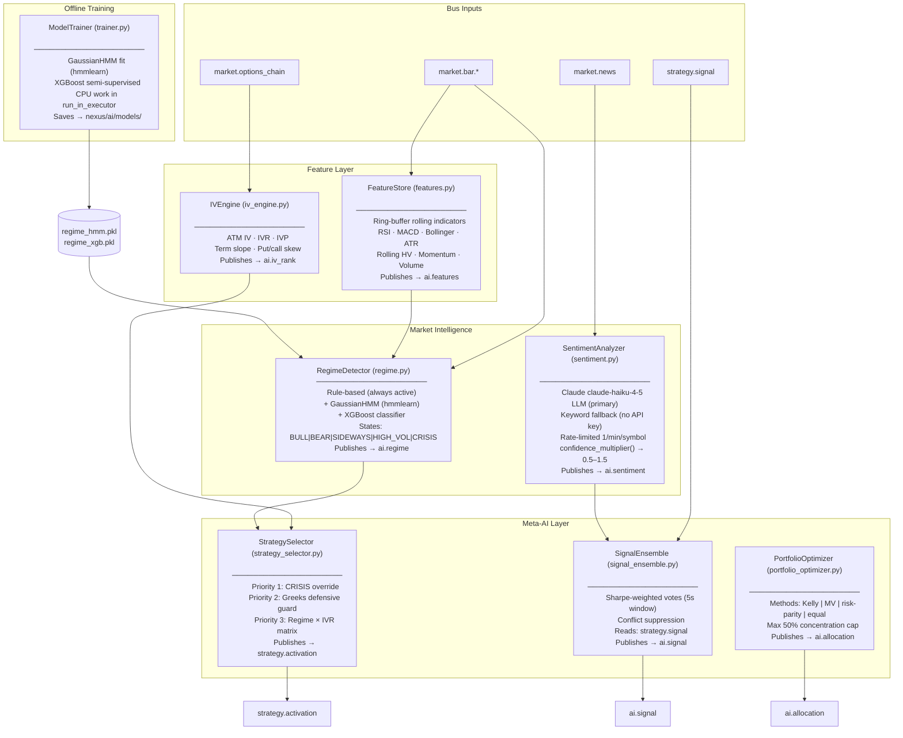
```mermaid
flowchart TD
    subgraph Inputs["Bus Inputs"]
        MB["market.bar.*"]
        MO["market.options_chain"]
        MN["market.news"]
        SS["strategy.signal"]
    end

    subgraph Features["Feature Layer"]
        FS["FeatureStore (features.py)
        ─────────────────────
        Ring-buffer rolling indicators
        RSI · MACD · Bollinger · ATR
        Rolling HV · Momentum · Volume
        Publishes → ai.features"]

        IVE["IVEngine (iv_engine.py)
        ─────────────────────
        ATM IV · IVR · IVP
        Term slope · Put/call skew
        Publishes → ai.iv_rank"]
    end

    subgraph Intelligence["Market Intelligence"]
        RD["RegimeDetector (regime.py)
        ─────────────────────
        Rule-based (always active)
        + GaussianHMM (hmmlearn)
        + XGBoost classifier
        States: BULL|BEAR|SIDEWAYS|HIGH_VOL|CRISIS
        Publishes → ai.regime"]

        SA["SentimentAnalyzer (sentiment.py)
        ─────────────────────
        Claude claude-haiku-4-5 LLM (primary)
        Keyword fallback (no API key)
        Rate-limited 1/min/symbol
        confidence_multiplier() → 0.5–1.5
        Publishes → ai.sentiment"]
    end

    subgraph MetaAI["Meta-AI Layer"]
        SEL["StrategySelector (strategy_selector.py)
        ─────────────────────
        Priority 1: CRISIS override
        Priority 2: Greeks defensive guard
        Priority 3: Regime × IVR matrix
        Publishes → strategy.activation"]

        ENS["SignalEnsemble (signal_ensemble.py)
        ─────────────────────
        Sharpe-weighted votes (5s window)
        Conflict suppression
        Reads: strategy.signal
        Publishes → ai.signal"]

        PO["PortfolioOptimizer (portfolio_optimizer.py)
        ─────────────────────
        Methods: Kelly | MV | risk-parity | equal
        Max 50% concentration cap
        Publishes → ai.allocation"]
    end

    subgraph Training["Offline Training"]
        MT["ModelTrainer (trainer.py)
        ─────────────────────
        GaussianHMM fit (hmmlearn)
        XGBoost semi-supervised
        CPU work in run_in_executor
        Saves → nexus/ai/models/"]
    end

    MB --> FS
    MB --> RD
    MO --> IVE
    MN --> SA
    SS --> ENS

    FS --> RD
    IVE --> SEL
    RD --> SEL
    SA --> ENS

    SEL --> ACTIV_OUT["strategy.activation"]
    ENS --> AISIG["ai.signal"]
    PO --> AIALLOC["ai.allocation"]
    MT --> MODELS[("regime_hmm.pkl\nregime_xgb.pkl")]
    MODELS --> RD
```

**Regime × IVR Decision Matrix:**

| Regime | IVR < 30 | IVR 30–50 | IVR > 50 |
|--------|----------|-----------|----------|
| BULL_TREND | MA Crossover, Bull Spread | MA Crossover, CSP | Covered Call, CSP |
| BEAR_TREND | Bear Spread, Long Put | Bear Spread, Protective Put | Bear Spread, Protective Put |
| SIDEWAYS_CHOP | Iron Condor | Iron Condor, Strangle | Iron Condor, Strangle (primary) |
| HIGH_VOL | Scale down all | Scale down all | Iron Condor, Short Strangle |
| CRISIS | **CASH — all deactivated** | **CASH** | **CASH** |

---

## 7. Order Management System (OMS)

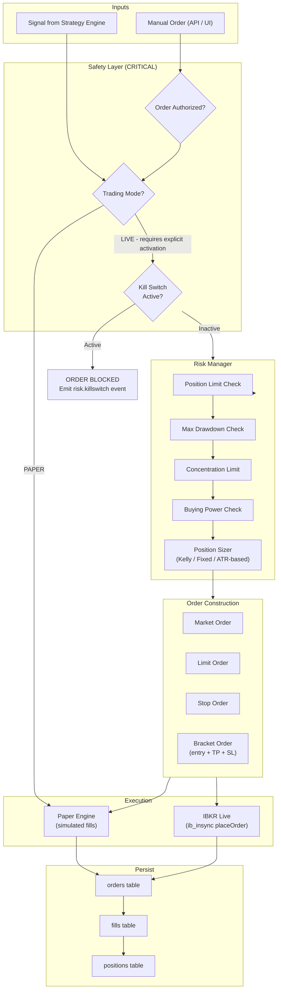
```mermaid
flowchart TD
    subgraph Input["Inputs"]
        SIG_IN["Signal from Strategy Engine"]
        MANUAL["Manual Order (API / UI)"]
    end

    subgraph Safety["Safety Layer (CRITICAL)"]
        MODE{"Trading Mode?"}
        KILL{"Kill Switch\nActive?"}
        AUTH{"Order Authorized?"}
    end

    subgraph RiskChecks["Risk Manager"]
        POS_LIM["Position Limit Check"]
        DRAWDOWN["Max Drawdown Check"]
        CONC["Concentration Limit"]
        BUYING_PWR["Buying Power Check"]
        SIZE["Position Sizer\n(Kelly / Fixed / ATR-based)"]
    end

    subgraph OrderTypes["Order Construction"]
        MKT["Market Order"]
        LMT["Limit Order"]
        STP["Stop Order"]
        BRACKET["Bracket Order\n(entry + TP + SL)"]
    end

    subgraph Execution["Execution"]
        PAPER_EX["Paper Engine\n(simulated fills)"]
        LIVE_EX["IBKR Live\n(ib_insync placeOrder)"]
    end

    subgraph Persistence["Persist"]
        DB_ORD["orders table"]
        DB_FILL["fills table"]
        DB_POS["positions table"]
    end

    SIG_IN --> MODE
    MANUAL --> AUTH
    AUTH --> MODE

    MODE -->|PAPER| PAPER_EX
    MODE -->|LIVE - requires explicit activation| KILL
    KILL -->|Active| BLOCKED["ORDER BLOCKED\nEmit risk.killswitch event"]
    KILL -->|Inactive| RiskChecks

    RiskChecks --> POS_LIM
    POS_LIM --> DRAWDOWN
    DRAWDOWN --> CONC
    CONC --> BUYING_PWR
    BUYING_PWR --> SIZE
    SIZE --> OrderTypes

    OrderTypes --> PAPER_EX
    OrderTypes --> LIVE_EX

    PAPER_EX --> DB_ORD
    LIVE_EX --> DB_ORD
    DB_ORD --> DB_FILL
    DB_FILL --> DB_POS
```

---

## 8. Backtesting Engine (Phase 3)

Six files in `nexus/backtest/`. Uses the **same strategy code as live** — zero duplication.

| File | Class | Responsibility |
|------|-------|----------------|
| `engine.py` | `BacktestEngine` | Orchestrates replay; installs `BacktestPublisher` mock |
| `data_loader.py` | `DataLoader` | CSV · Parquet · TimescaleDB loaders; multi-format column detection |
| `options_pricer.py` | `HistoricalVolatility`, `IVSurface`, `PricerChainBuilder` | Synthetic IV surface from rolling HV; full `OptionsChainSnapshot` via Black-Scholes |
| `fill_simulator.py` | `FillSimulator` | NEXT_BAR_OPEN · CLOSE · VWAP · MID_PRICE fill modes; IBKR commission model |
| `analytics.py` | `PerformanceMetrics`, `compute_metrics()` | Sharpe · Sortino · Calmar · max drawdown · win rate · profit factor (pure numpy) |
| `walk_forward.py` | `WalkForwardOptimizer` | Rolling 70/30 train/test; async parallel grid search; param stability via CV |

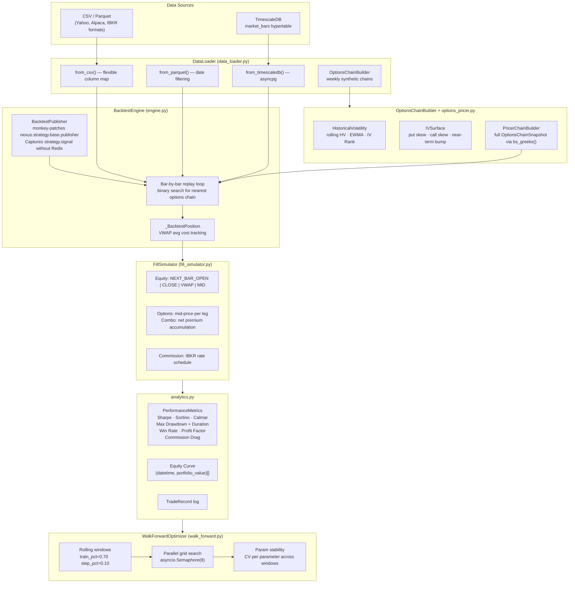
```mermaid
flowchart TD
    subgraph DataSources["Data Sources"]
        CSV["CSV / Parquet\n(Yahoo, Alpaca, IBKR formats)"]
        TSDB["TimescaleDB\nmarket_bars hypertable"]
    end

    subgraph DataLoader["DataLoader (data_loader.py)"]
        DL_CSV["from_csv() — flexible column map"]
        DL_PQ["from_parquet() — date filtering"]
        DL_TS["from_timescaledb() — asyncpg"]
        OCB["OptionsChainBuilder\nweekly synthetic chains"]
    end

    subgraph Engine["BacktestEngine (engine.py)"]
        BPub["BacktestPublisher\nmonkey-patches nexus.strategy.base.publisher\nCaptures strategy.signal without Redis"]
        REPLAY["Bar-by-bar replay loop\nbinary search for nearest options chain"]
        POS["_BacktestPosition\nVWAP avg cost tracking"]
    end

    subgraph Pricer["OptionsChainBuilder + options_pricer.py"]
        HV["HistoricalVolatility\nrolling HV · EWMA · IV Rank"]
        IVS["IVSurface\nput skew · call skew · near-term bump"]
        PCB["PricerChainBuilder\nfull OptionsChainSnapshot via bs_greeks()"]
    end

    subgraph FillSim["FillSimulator (fill_simulator.py)"]
        EQ_FILL["Equity: NEXT_BAR_OPEN | CLOSE | VWAP | MID"]
        OPT_FILL["Options: mid-price per leg\nCombo: net premium accumulation"]
        COMM["Commission: IBKR rate schedule"]
    end

    subgraph Analytics["analytics.py"]
        METRICS["PerformanceMetrics\nSharpe · Sortino · Calmar\nMax Drawdown + Duration\nWin Rate · Profit Factor\nCommission Drag"]
        EC["Equity Curve\n(datetime, portfolio_value)[]"]
        TRADES["TradeRecord log"]
    end

    subgraph WFO["WalkForwardOptimizer (walk_forward.py)"]
        WINDOWS["Rolling windows\ntrain_pct=0.70  step_pct=0.10"]
        GRID["Parallel grid search\nasyncio.Semaphore(8)"]
        STAB["Param stability\nCV per parameter across windows"]
    end

    CSV --> DL_CSV
    TSDB --> DL_TS
    DL_CSV --> REPLAY
    DL_PQ --> REPLAY
    DL_TS --> REPLAY
    OCB --> Pricer
    PCB --> REPLAY

    BPub --> REPLAY
    REPLAY --> POS
    POS --> FillSim
    FillSim --> Analytics

    Analytics --> WFO
    WINDOWS --> GRID
    GRID --> STAB
```

**Key design: `BacktestPublisher`** temporarily replaces `nexus.strategy.base.publisher` during
a run, capturing signals without touching Redis. Restored in `finally` — strategy code is
never aware it is being backtested.

---

## 9. Database Schema Overview

> All schema changes managed via **Liquibase** changesets in `db/changelogs/`.

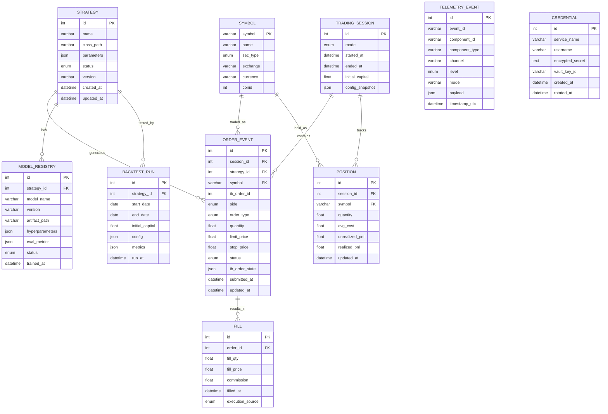
```mermaid
erDiagram
    STRATEGY {
        int id PK
        varchar name
        varchar class_path
        json parameters
        enum status
        varchar version
        datetime created_at
        datetime updated_at
    }

    MODEL_REGISTRY {
        int id PK
        int strategy_id FK
        varchar model_name
        varchar version
        varchar artifact_path
        json hyperparameters
        json eval_metrics
        enum status
        datetime trained_at
    }

    SYMBOL {
        varchar symbol PK
        varchar name
        enum sec_type
        varchar exchange
        varchar currency
        int conid
    }

    TRADING_SESSION {
        int id PK
        enum mode
        datetime started_at
        datetime ended_at
        float initial_capital
        json config_snapshot
    }

    ORDER_EVENT {
        int id PK
        int session_id FK
        int strategy_id FK
        varchar symbol FK
        int ib_order_id
        enum side
        enum order_type
        float quantity
        float limit_price
        float stop_price
        enum status
        json ib_order_state
        datetime submitted_at
        datetime updated_at
    }

    FILL {
        int id PK
        int order_id FK
        float fill_qty
        float fill_price
        float commission
        datetime filled_at
        enum execution_source
    }

    POSITION {
        int id PK
        int session_id FK
        varchar symbol FK
        float quantity
        float avg_cost
        float unrealized_pnl
        float realized_pnl
        datetime updated_at
    }

    BACKTEST_RUN {
        int id PK
        int strategy_id FK
        date start_date
        date end_date
        float initial_capital
        json config
        json metrics
        datetime run_at
    }

    TELEMETRY_EVENT {
        int id PK
        varchar event_id
        varchar component_id
        varchar component_type
        varchar channel
        enum level
        varchar mode
        json payload
        datetime timestamp_utc
    }

    CREDENTIAL {
        int id PK
        varchar service_name
        varchar username
        text encrypted_secret
        varchar vault_key_id
        datetime created_at
        datetime rotated_at
    }

    STRATEGY ||--o{ ORDER_EVENT : "generates"
    STRATEGY ||--o{ MODEL_REGISTRY : "has"
    STRATEGY ||--o{ BACKTEST_RUN : "tested_by"
    ORDER_EVENT ||--o{ FILL : "results_in"
    SYMBOL ||--o{ ORDER_EVENT : "traded_as"
    SYMBOL ||--o{ POSITION : "held_as"
    TRADING_SESSION ||--o{ ORDER_EVENT : "contains"
    TRADING_SESSION ||--o{ POSITION : "tracks"
```

---

## 10. Security Model

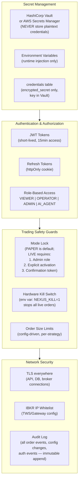
```mermaid
flowchart TD
    subgraph Secrets["Secret Management"]
        VAULT["HashiCorp Vault\nor AWS Secrets Manager\n(NEVER store plaintext credentials)"]
        ENV["Environment Variables\n(runtime injection only)"]
        CRED_DB["credentials table\n(encrypted_secret only,\nkey in Vault)"]
    end

    subgraph Auth["Authentication & Authorization"]
        JWT["JWT Tokens\n(short-lived, 15min access)"]
        REFRESH["Refresh Tokens\n(httpOnly cookie)"]
        RBAC["Role-Based Access\nVIEWER | OPERATOR | ADMIN | AI_AGENT"]
    end

    subgraph TradingGuards["Trading Safety Guards"]
        MODE_LOCK["Mode Lock\n(PAPER is default;\nLIVE requires:\n1. Admin role\n2. Explicit activation\n3. Confirmation token)"]
        KILL_SW["Hardware Kill Switch\n(env var: NEXUS_KILL=1\nstops all live orders)"]
        ORDER_LIMIT["Order Size Limits\n(config-driven, per-strategy)"]
    end

    subgraph Network["Network Security"]
        TLS["TLS everywhere\n(API, DB, broker connections)"]
        IBKR_IP["IBKR IP Whitelist\n(TWS/Gateway config)"]
        AUDIT["Audit Log\n(all order events, config changes,\nauth events — immutable append)"]
    end

    Secrets --> Auth
    Auth --> TradingGuards
    TradingGuards --> Network
```

---

## Technology Stack

| Layer | Technology | Rationale |
|-------|-----------|-----------|
| Broker Integration | `ib_insync` (Python) | Best async Python client for IBKR; uses asyncio natively |
| API Backend | FastAPI (Python) | Async, auto-OpenAPI docs, WebSocket support |
| Event Bus | Redis Streams | Kafka-compatible patterns without broker ops overhead; upgrade path to Kafka if scale demands |
| Relational DB | PostgreSQL 16 | Orders, positions, strategy config, audit |
| Time-Series DB | TimescaleDB (Postgres extension) | High-performance OHLCV/tick storage; SQL-compatible |
| Schema Management | Liquibase | Versioned, rollback-capable DB migrations |
| Strategy Framework | Custom ABC (event-driven) | Same code path for live, paper, and backtest |
| Backtesting | Custom event-driven replay engine | `BacktestEngine` + `WalkForwardOptimizer` in `nexus/backtest/` |
| Regime Detection | `hmmlearn` GaussianHMM + XGBoost | Unsupervised HMM labels history; XGBoost learns semi-supervised |
| LLM Sentiment | Anthropic Claude (`claude-haiku-4-5`) | Structured JSON sentiment on news; keyword fallback if no API key |
| ML/AI Stack | `scikit-learn`, `hmmlearn`, `xgboost`, `cvxpy` | Ensemble weighting, regime HMM, XGBoost classifier, portfolio optimisation |
| Portfolio Optimisation | `scipy.optimize` (SLSQP) + custom Kelly/risk-parity | Three allocation methods; 50% max concentration cap |
| Quant / Data | `pandas`, `numpy`, `scipy` | Feature engineering, analytics, Black-Scholes Greeks |
| Scheduler | APScheduler | Cron-like scheduling within Python |
| Dashboard | React + Recharts / Streamlit (prototype) | Real-time charts, order blotter, telemetry feed |
| Container | Docker + Docker Compose | Local dev; K8s-ready for production |
| Secrets | HashiCorp Vault (or AWS Secrets Manager) | Never store credentials in config files |

---

## Known Constraints & Risks

| # | Constraint | Mitigation |
|---|-----------|-----------|
| 1 | IBKR historical data rate limit (~60 req/10min) | Queue + throttle requests; pre-cache in time-series DB |
| 2 | IBKR paper account: 100 market data line limit | Symbol watchlist management; prioritize active symbols |
| 3 | PostgreSQL for time-series is suboptimal | Use TimescaleDB (pg extension) for OHLCV/tick data; plain PostgreSQL for relational state |
| 4 | Single point of failure: Redis | Use Redis Sentinel or Cluster for production; acceptably simple for dev |
| 5 | Live trading safety | PAPER mode default; LIVE requires admin + explicit token activation |
| 6 | Model overfitting in backtest | Walk-forward validation, out-of-sample test sets mandatory |
| 7 | ib_insync requires TWS/Gateway running | Monitor TWS uptime; implement reconnect watchdog |

---

## Development Phases

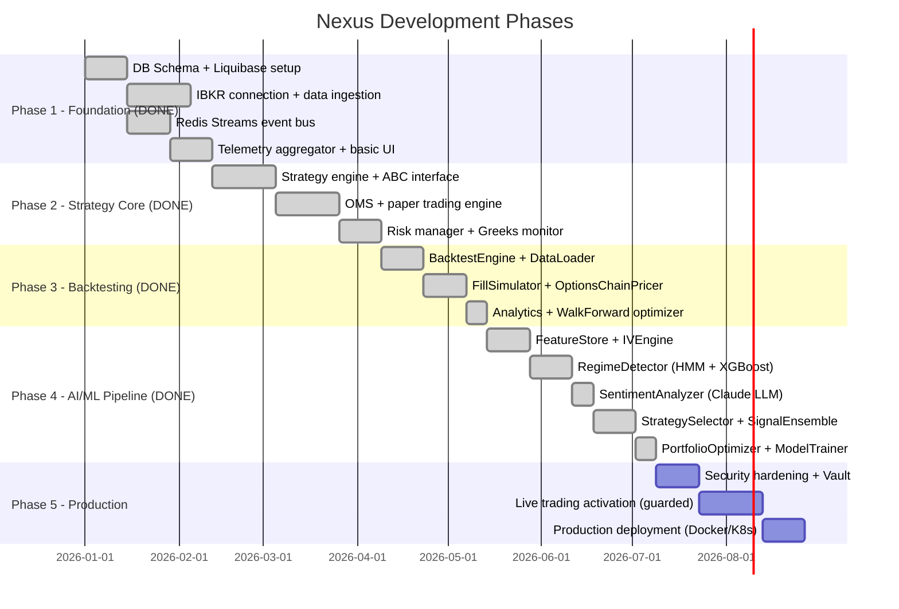
```mermaid
gantt
    title Nexus Development Phases
    dateFormat  YYYY-MM
    section Phase 1 - Foundation (DONE)
    DB Schema + Liquibase setup        :done, p1a, 2026-01, 2w
    IBKR connection + data ingestion   :done, p1b, after p1a, 3w
    Redis Streams event bus            :done, p1c, after p1a, 2w
    Telemetry aggregator + basic UI    :done, p1d, after p1c, 2w

    section Phase 2 - Strategy Core (DONE)
    Strategy engine + ABC interface    :done, p2a, after p1d, 3w
    OMS + paper trading engine         :done, p2b, after p2a, 3w
    Risk manager + Greeks monitor      :done, p2c, after p2b, 2w

    section Phase 3 - Backtesting (DONE)
    BacktestEngine + DataLoader        :done, p3a, after p2c, 2w
    FillSimulator + OptionsChainPricer :done, p3b, after p3a, 2w
    Analytics + WalkForward optimizer  :done, p3c, after p3b, 1w

    section Phase 4 - AI/ML Pipeline (DONE)
    FeatureStore + IVEngine            :done, p4a, after p3c, 2w
    RegimeDetector (HMM + XGBoost)     :done, p4b, after p4a, 2w
    SentimentAnalyzer (Claude LLM)     :done, p4c, after p4b, 1w
    StrategySelector + SignalEnsemble  :done, p4d, after p4c, 2w
    PortfolioOptimizer + ModelTrainer  :done, p4e, after p4d, 1w

    section Phase 5 - Production
    Security hardening + Vault         :p5a, after p4e, 2w
    Live trading activation (guarded)  :p5b, after p5a, 3w
    Production deployment (Docker/K8s) :p5c, after p5b, 2w
```

---

## Directory Structure (Planned)

```
nexus/
├── db/
│   ├── changelogs/                     # Liquibase changesets (7 changesets, Phase 1)
│   │   ├── 001-symbols.xml
│   │   ├── 002-credentials.xml
│   │   ├── 003-strategy.xml
│   │   ├── 004-session.xml
│   │   ├── 005-orders.xml
│   │   ├── 006-backtest.xml
│   │   └── 007-telemetry.xml
│   └── timescaledb/
│       └── init.sql                    # market_bars + market_ticks hypertables
├── nexus/
│   ├── core/
│   │   ├── config.py                   # pydantic-settings; TradingMode enum; NEXUS_KILL_SWITCH
│   │   └── schemas.py                  # BarData, Signal, OptionsContract, PortfolioGreeks, ...
│   ├── bus/
│   │   ├── publisher.py                # EventPublisher (Redis XADD); module singleton
│   │   └── consumer.py                 # EventConsumer (XREAD + XREADGROUP + XACK)
│   ├── ingestion/
│   │   └── ibkr_connector.py           # IBKRConnector; watchdog; tick/bar/historical
│   ├── telemetry/
│   │   └── aggregator.py               # TelemetryAggregator; WebSocket fan-out; ring buffer
│   ├── strategy/
│   │   ├── base.py                     # BaseStrategy ABC; hot-reload params
│   │   ├── registry.py                 # StrategyRegistry; strategy.activation consumer
│   │   └── strategies/
│   │       ├── ma_crossover.py         # MA Crossover equity strategy
│   │       └── iron_condor.py          # Iron Condor options strategy
│   ├── risk/
│   │   ├── greeks.py                   # Black-Scholes Greeks; GreeksMonitor
│   │   ├── limits.py                   # LimitsChecker; configurable position/Greeks/drawdown limits
│   │   └── manager.py                  # RiskManager; kill switch → drawdown → Greeks → size
│   ├── oms/
│   │   ├── sizer.py                    # PositionSizer: fixed_pct | kelly | atr | confidence
│   │   ├── order_builder.py            # OrderBuilder: single/multi-leg; bracket; IBKR BAG combos
│   │   ├── paper_engine.py             # PaperEngine; PositionBook (VWAP); IBKR commission model
│   │   └── router.py                   # SignalRouter; source_channel (strategy.signal|ai.signal); sentiment mod
│   ├── backtest/
│   │   ├── __init__.py                 # Public API
│   │   ├── engine.py                   # BacktestEngine; BacktestPublisher; BacktestConfig/Result
│   │   ├── data_loader.py              # DataLoader (CSV/Parquet/TimescaleDB); OptionsChainBuilder
│   │   ├── options_pricer.py           # HistoricalVolatility; IVSurface; PricerChainBuilder
│   │   ├── fill_simulator.py           # FillSimulator; FillMethod enum; IBKR commission model
│   │   ├── analytics.py                # PerformanceMetrics; compute_metrics(); rolling_sharpe()
│   │   └── walk_forward.py             # WalkForwardOptimizer; async grid search; param stability
│   └── ai/
│       ├── __init__.py                 # Public API; channel map
│       ├── features.py                 # FeatureStore; pure Python ring buffers; → ai.features
│       ├── iv_engine.py                # IVEngine; IVR · IVP · term slope · skew; → ai.iv_rank
│       ├── regime.py                   # RegimeDetector; rule-based + HMM + XGBoost; → ai.regime
│       ├── sentiment.py                # SentimentAnalyzer; Claude LLM + keyword fallback; → ai.sentiment
│       ├── strategy_selector.py        # StrategySelector; Regime × IVR matrix; → strategy.activation
│       ├── signal_ensemble.py          # SignalEnsemble; Sharpe-weighted votes; → ai.signal
│       ├── portfolio_optimizer.py      # PortfolioOptimizer; Kelly|MV|risk-parity; → ai.allocation
│       ├── trainer.py                  # ModelTrainer; HMM + XGBoost; run_in_executor
│       └── models/                     # Trained model artifacts (regime_hmm.pkl, regime_xgb.pkl)
├── tests/
├── docker-compose.yml                  # PostgreSQL 16 · TimescaleDB (port 5433) · Redis 7
├── pyproject.toml                      # Python 3.11+; [ml] extras: anthropic, hmmlearn, xgboost, cvxpy
└── README.md
```

---

> **Next Step:** Phase 5 — Production hardening.
> Key tasks: Vault secret injection, FastAPI auth routes (JWT/RBAC), live-trading activation gate,
> Docker Compose production profiles, monitoring/alerting, and end-to-end integration tests.
>
> Run `docker-compose up` to start PostgreSQL, Redis, and TimescaleDB locally.
> Install ML extras: `pip install -e "nexus/[ml,dev]"`
