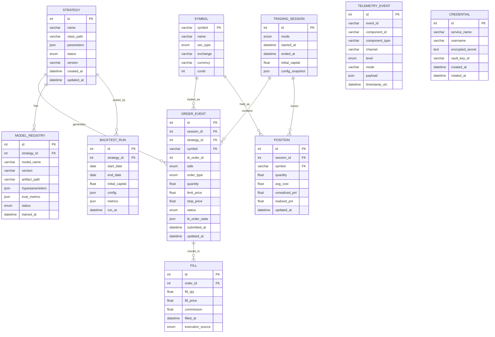

# Nexus — AI-First Quantitative Trading Platform

> An event-driven, modular, AI-first quantitative trading platform built on IBKR data feeds,
> with full backtesting, paper/live trading, real-time observability, and a MySQL persistence layer
> managed by Liquibase.

---

## Table of Contents

1. [Design Principles](#design-principles)
2. [System Context](#1-system-context-c4-level-1)
3. [Container Architecture](#2-container-architecture-c4-level-2)
4. [Data Flow](#3-data-flow)
5. [Event Bus & Component Telemetry](#4-event-bus--component-telemetry)
6. [Data Ingestion Layer](#5-data-ingestion-layer)
7. [Strategy & AI Engine](#6-strategy--ai-engine)
8. [Order Management System](#7-order-management-system-oms)
9. [Backtesting Engine](#8-backtesting-engine)
10. [Database Schema Overview](#9-database-schema-overview)
11. [Security Model](#10-security-model)
12. [Technology Stack](#technology-stack)
13. [Known Constraints & Risks](#known-constraints--risks)
14. [Development Phases](#development-phases)

---

## Design Principles

| Principle | Description |
|-----------|-------------|
| **AI-First** | Every module exposes parameters consumable by AI agents; strategy logic is ML-replaceable |
| **Modular** | Each component is independently deployable and observable |
| **Data-Driven** | All component state/config is persisted and driven from data, never hardcoded |
| **Event-Driven** | Components communicate via an in-memory event bus; no direct coupling |
| **Observable** | Every component emits timestamped telemetry events; UI is a passive consumer |
| **Safe by Default** | Paper trading is the default; live trading requires explicit multi-step activation |
| **Schema-Managed** | All DB changes via Liquibase changesets, never manual |

---

## 1. System Context (C4 Level 1)


---

## 2. Container Architecture (C4 Level 2)


---

## 3. Data Flow


---

## 4. Event Bus & Component Telemetry

Every component emits a standardized telemetry event. The UI consumes these passively.

### Telemetry Event Schema


### Redis Streams Channel Map


---

## 5. Data Ingestion Layer


**IBKR Data Limits to design around:**
- Paper account: 100 simultaneous market data lines
- Historical data: ~60 requests / 10 minutes
- Real-time bars: 5-second granularity minimum via API

---

## 6. Strategy & AI Engine


---

## 7. Order Management System (OMS)


---

## 8. Backtesting Engine


---

## 9. Database Schema Overview

> All schema changes managed via **Liquibase** changesets in `db/changelogs/`.



---

## 10. Security Model


---

## Technology Stack

| Layer | Technology | Rationale |
|-------|-----------|-----------|
| Broker Integration | `ib_insync` (Python) | Best async Python client for IBKR; uses asyncio natively |
| API Backend | FastAPI (Python) | Async, auto-OpenAPI docs, WebSocket support |
| Event Bus | Redis Streams | **Confirmed.** Kafka-compatible patterns without broker ops overhead; upgrade path to Kafka if scale demands |
| Relational DB | MySQL 8.x | Orders, positions, strategy config, audit |
| Time-Series DB | TimescaleDB (Postgres extension) | High-performance OHLCV/tick storage; SQL-compatible. **Confirmed primary time-series store.** |
| Schema Management | Liquibase | Versioned, rollback-capable DB migrations |
| Strategy Framework | Custom ABC + VectorBT / Zipline-reloaded | Backtesting; custom ABC for live |
| ML/AI | PyTorch, scikit-learn, LangChain | Model training and LLM-based signal generation |
| Scheduler | APScheduler | Cron-like scheduling within Python |
| Dashboard | React + Recharts / Streamlit (prototype) | Real-time charts, order blotter, telemetry feed |
| Container | Docker + Docker Compose | Local dev; K8s-ready for production |
| Secrets | HashiCorp Vault (or AWS Secrets Manager) | Never store credentials in config files |

---

## Known Constraints & Risks

| # | Constraint | Mitigation |
|---|-----------|-----------|
| 1 | IBKR historical data rate limit (~60 req/10min) | Queue + throttle requests; pre-cache in time-series DB |
| 2 | IBKR paper account: 100 market data line limit | Symbol watchlist management; prioritize active symbols |
| 3 | MySQL is not ideal for tick-level time-series | Use TimescaleDB for OHLCV/tick data; MySQL for relational state |
| 4 | Single point of failure: Redis | Use Redis Sentinel or Cluster for production; acceptably simple for dev |
| 5 | Live trading safety | PAPER mode default; LIVE requires admin + explicit token activation |
| 6 | Model overfitting in backtest | Walk-forward validation, out-of-sample test sets mandatory |
| 7 | ib_insync requires TWS/Gateway running | Monitor TWS uptime; implement reconnect watchdog |

---

## Development Phases


---

## Directory Structure (Planned)

```
nexus/
├── db/
│   ├── changelogs/           # Liquibase changesets
│   │   ├── 001-initial.xml
│   │   └── ...
│   └── liquibase.properties
├── nexus/
│   ├── ingestion/            # Data ingestion services
│   │   ├── ibkr_connector.py
│   │   ├── news_ingester.py
│   │   └── historical_puller.py
│   ├── strategy/             # Strategy engine + ABC
│   │   ├── base.py           # Strategy ABC
│   │   ├── registry.py
│   │   └── strategies/       # Concrete strategy implementations
│   ├── ai/                   # ML/AI engine
│   │   ├── features.py
│   │   ├── model_registry.py
│   │   └── models/
│   ├── oms/                  # Order management
│   │   ├── order_manager.py
│   │   ├── paper_engine.py
│   │   └── risk_manager.py
│   ├── backtest/             # Backtesting engine
│   │   ├── engine.py
│   │   └── analytics.py
│   ├── bus/                  # Event bus
│   │   ├── publisher.py
│   │   └── consumer.py
│   ├── telemetry/            # Telemetry aggregation
│   │   └── aggregator.py
│   ├── api/                  # FastAPI routes
│   │   ├── main.py
│   │   ├── auth.py
│   │   └── routes/
│   └── core/                 # Shared schemas, config, utils
│       ├── schemas.py        # Pydantic models (BarData, Signal, TelemetryEvent...)
│       ├── config.py
│       └── security.py
├── ui/                       # React dashboard
├── tests/
├── docker-compose.yml
├── pyproject.toml
└── README.md
```

---

> **Next Step:** Begin with Phase 1 — Liquibase schema setup + IBKR connection manager.
> Run `docker-compose up` to start MySQL, Redis, and TimescaleDB locally.
